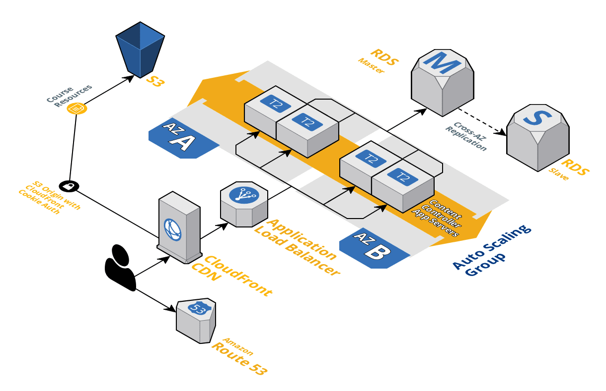

# Hosting at Scale

When you move to production with Content Controller, security and uptime become important.  If you follow the [Deploying in AWS](aws/AWS.md) instructions, then we'll explain how to deploy with these concerns in mind.

## Production Environment

These architecture diagrams look at what a production-grade Content Controller environment should look like in Amazon Web Services.  If you aren't using AWS, it should still be similar (minus CloudFront and S3).

### High Level Overview

### Networking and Security Overview

Some key points to take from the diagrams:

* Application and database servers should be in a private subnet (inaccessible from the outside world) and should be spread across availability zones, if possible.
* Your Ansible server will need to be in the public subnet along with the load balancer, or you will need a VPN connection to be able to access the Ansible server via SSH.
* Database access should occur through a VPN or through the Ansible server over an SSH tunnel.

## Managed Hosting

We also provide managed hosting services for Content Controller, which can be a great alternative if you need to get a large-scale production installation up and running quickly.

## More information

https://support.scorm.com/hc/en-us/categories/115000007313-Hosting-Infrastructure-and-Servers
