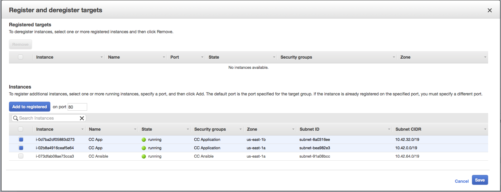

# Deploying Content Controller

The best way to deploy Content Controller is to start with a blank server, provision it with the Ansible scripts, image it, and then deploy as many servers as you need from that image.  This makes rollbacks easier, ensures you have a reproducable server state, allows you to setup an auto-scaling group later on, and in many cases will allow you to do 0 downtime upgrades.  If you're using Amazon Web Services, we've provided a playbook to automate this task for you.  Unless you have a really good reason not to, you should use this method.

## Running the Build AMI Playbooks

`build_ami.yml` will
* Generate an SSH key pair for Ansible to use (if needed)
* Create a blank Ubuntu instance and provision an Ansible user with sudo powers
* Run the Ansible playbooks against it
* **Run database upgrades against your production DB** (this can be turned off if needed, but you'll have to run them before deploying the AMI)
* Create an Amazon Machine Image of the server
* Destroy the temporary server

Before getting started, we recommend making an image of your RDS instance, so you can rollback if needed.  It's also a good idea to do this during a maintenance window.  Before running this playbook, you should have completed all of the steps in this guide, and you should be sure that your `group_vars` settings are correct.

1. Go to the `ContentController-PublicDeploy` folder on your Ansible control server.
2. Run the playbook:
```
ansible-playbook -e "env=prod" build_ami.yml
```

## Deploying an AMI

### Deploying an AMI Manually

Go to **Services** -> **EC2** in AWS.

1. Click **Instances** on the left sidebar, and click **Launch Instance**.
2. Select the **My AMIs* tab.
3. Click **Select** beside `ContentController-v.v.v_env_xxxxxxxx` (the one corresponding to the AMI you would like to deploy).
4. Choose an instance size (t2.medium or larger) and click **Next: Configure Instance Details**.
5. Choose `Rustici CC VPC` for your Network, `CC Private 1` for your Subnet, `Disable` for Auto-assign Public IP, `None` for the IAM role, disable protect against accidental termination, enable T2 unlimited if you'd like, and click **Next: Add Storage**.
6. Enter a value for the root volume size (100 GB is probably good) and check Delete on Termination.  Click **Next: Add Tags**.
7. Click **Add Tag**.  Enter `Name` for the Key and `CC App` for the Value.  Click **Next: Configure Security Group**.
8. Choose **Select an existing security group** and check the box beside the `CC Application` security group you created earlier.
9. Click **Review and Launch**.
10. Click **Launch**.
11. Select **Choose an existing key pair** and select the `rustici-cc` key pair that you created earlier.  Check the **I acknowledge...** box, and then click **Launch Instances**.
12. Select the instance in the **Instances** list and in the **Description** tab, copy the **Private IP** address.
13. Repeat steps 1-12, but this time choose `CC Private 2` for your Subnet.  This way you'll have at least 1 server in each availability zones.
14. Click **Target Groups** on the left sidebar and select your `cc-prod-target-group`.
15. Click on the **Targets** tab, and click the blue **Edit** button.
16. Select the 2 (or more) application servers that you just launched, click **Add to registered**, and click **Save**. <br><br><br><br>
17. Once you're sure your servers are up, click **Edit** again, check the boxes beside the old app servers, click **Remove**, and click **Save**.
18. Go back to **Instances** and either stop or terminate your old app servers.

### Deploying an AMI with Auto Scaling Groups

If you're using AWS EC2 auto scaling, you can create a [launch configuration](https://docs.aws.amazon.com/autoscaling/ec2/userguide/LaunchConfiguration.html) with your newly built Amazon Machine Image.  Typically, you would have 2 [auto scaling groups](https://docs.aws.amazon.com/autoscaling/ec2/userguide/AutoScalingGroup.html) (maybe a blue group and a green group) that register their EC2 instances in your load balancer's target group.  When you're upgrading, you can apply a new launch configuration to the inactive auto scaling group, and change your policies to scale it up from `0` instances to `X` instances.  Once the new group's instances are reporting healthy, you can set the previous auto scaling group to scale it down to `0` instances so that it takes the old application servers out of service.  This gives you an easy way to roll out with no downtime, and an easy way to rollback if something goes sideways.

Auto scaling can be complicated to get configured correctly, so if you're going to set it up, give us a call.  Based on your unique environment, we can give you some rules to use as a starting point.

## Alternative Deploy Method

### Deploying Straight to Static Server(s)

If you're using bare metal or you just really don't want to build AMIs and deploy them, then you can run the playbooks directly against the application servers.  Note that you should still make a backup of some sort, and you'll likely have some downtime.

1. Setup your application servers.  These should be a base Ubuntu 14.04 or later install.  Take note of their IPs, the SSH user name, and the SSH key.
2. Go to the `ContentController-PublicDeploy` folder on your control server.
3. Copy `inventory` to `inventory.prod`.
4. Edit the inventory and delete the dummy IP addresses replacing them with the private/internal IP addresses of your application servers.
5. Run the Ansible playbooks against your production servers:
```
ansible-playbook --user=YOUR_SSH_USER --connection=ssh --inventory-file=inventory.prod env.yml
```

**Note:** you may need to add `--ask-sudo-pass` or `--private-key="~/.ssh/my_private_key.pem"` to get SSH to work.

## Upgrading to the Latest Content Controller Version

1. Take a look at the [Release Notes](https://support.scorm.com/hc/en-us/sections/115000419513-Release-Notes) to see if there are any important messages about self-hosting for any of the versions between the one you're starting on and the one you're moving to.
2. Go to the `ContentController-PublicDeploy` folder on your Ansible server.
3. Create an image of your DB and control server in case something goes sideways during the upgrade.
4. Run `git pull`, then run `git checkout vx.x.xxx` replacing `x.x.xxx` with the version number you are moving to.
5. Follow the steps above in **Running the Build AMI Playbooks** and **Deploying an AMI to Production** or **Alternative Deploy Method**.

## Customizing your AMI

Sometimes, you'll want to customize the image used for building your application server.  A good use case for this would be to add your own infrastructure monitoring daemons, log aggregation utilities, or server hardening settings.

1. Launch an Ubuntu 18.04 EC2 instance.
2. Connect to it, install updates (`apt update && apt upgrade -y`), and apply your customizations.
3. Create an AMI of the instance (and take note of the AMI ID once it is complete).
4. Terminate the EC2 instance.
5. On your Ansible server, navigate to `ContentController-PublicDeploy` and edit `group_vars/aws.yml`.
6. Set `webami: ami-********` to `webami: ami-your_custom_ami_id`.
7. Follow the instructions above for running the build AMI playbooks.

## Resources

[Amazon Machine Images](https://docs.aws.amazon.com/AWSEC2/latest/UserGuide/AMIs.html)

[AWS EC2 Auto Scaling](https://docs.aws.amazon.com/autoscaling/ec2/userguide/what-is-amazon-ec2-auto-scaling.html)

[EC2 Launch Configuration](https://docs.aws.amazon.com/autoscaling/ec2/userguide/LaunchConfiguration.html)
