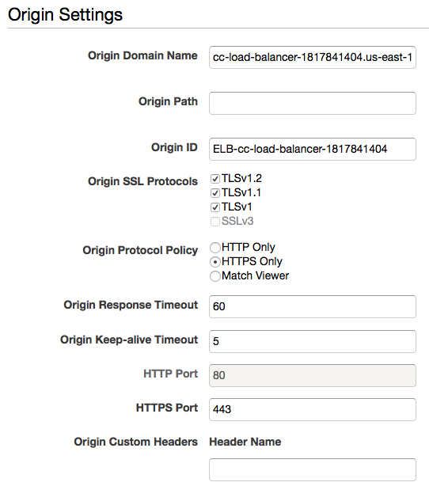
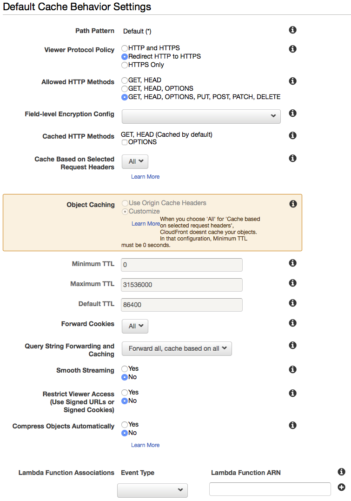
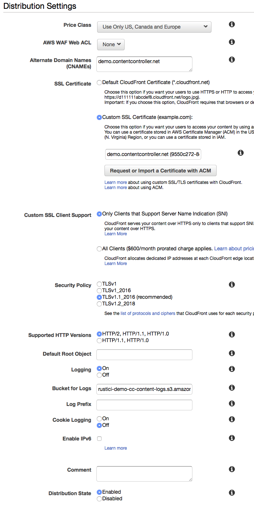
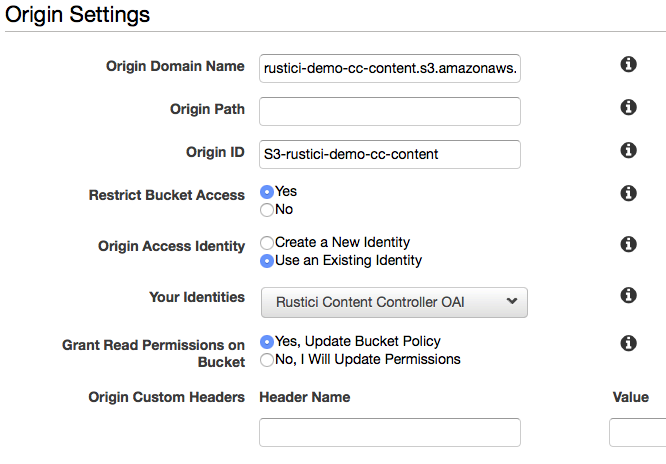
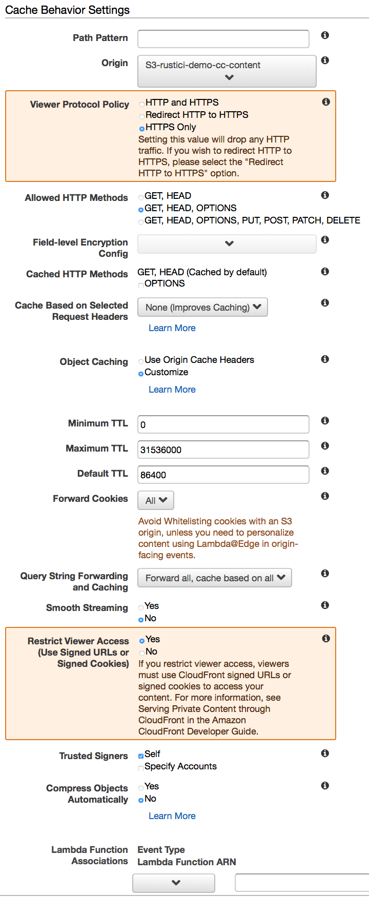

# CloudFront

Cloudfront acts like a reverse proxy in front of your Content Controller Server and the S3 bucket that you use for storing course content. For most connections, it just passes the request to your web tier. For requests for course content, CloudFront authenticates the user via a signed cookie that the application generates, and if the user is allowed, it serves up the content from your S3 bucket.

To get started, you need to have completed _at least_ the [Certificate Manager](CertificateManager.md), [S3](S3.md), and [Load Balancer and Target Group](LoadBalancer.md) steps in the [Deploying in AWS](AWS.md) section before this one, and it will be easiest if you have completed _all_ of the steps.

## Signing Keys

We use signed cookies to authenticate requests for content that lives in S3.  In order to make this work, you’ll need to generate a pair of signing keys and make them available to the application.

* [Generate your signing keys per this AWS doc](http://docs.aws.amazon.com/AmazonCloudFront/latest/DeveloperGuide/private-content-trusted-signers.html) and note the Access Key ID for the keypair.
* Convert the private key to DER format so that Java can read it:
```
openssl pkcs8 -topk8 -nocrypt -in pk-********************.pem  -inform PEM -out pk-********************.der  -outform DER
```

## Ansible Config

* Connect to your Ansible server and go to the `ContentController-PublicDeploy` folder.
* Run `mkdir -p roles/cloudfront/files` to create the files folder, if it doesn't already exist.
* Place the `pk-********************.der` and `rsa-********************.pem` files (generated above) in the `roles/cloudfront/files` folder.
* Edit the `group_vars/cloudfront.yml` file and make these changes.
  * Make sure that `use_cloudfront` is set to `true`.
  * Set your **Access Key ID** (created above) for the `cloudfront_access_key_id` variable.
  * Add the filename (without the path) for your key files similar to this:
    ```
    cloudfront_private_key: pk-********************.der
    cloudfront_public_key: rsa-********************.pem
    ```

## Create your Distribution

Go to **Services** -> **CloudFront**

### Create a Distribution for Content Controller

1. Select the **Distributions** tab on the left, and click the blue **Create Distribution** button.
2. Under **Web**, click **Get Started**.
3. For **Origin Settings**, enter these values
  * Origin Domain Name: `cc-load-balancer-*****` (choose the load balancer you created earlier)
  * Origin Path: leave it blank
  * Origin ID: should be auto-filled when you select your load balancer above
  * Origin SSL Protocols: Select **TLSv1**, **TLSv1.1**, **TLSv1.2**
  * Origin Protocol Policy: **HTTPS Only***
  * Origin Response Timeout: 60
  * Origin Keep-alive Timeout: 5
  * HTTP Port: 80
  * HTTPS Port: 443
  <br><br><br><br>
4. For **Default Cache Behavior Settings**, enter these values
  * Origin: should be auto-filled when you select your load balancer above
  * Viewer Protocol Policy: **Redirect HTTP to HTTPS**
  * Allowed HTTP Methods: **GET, HEAD, OPTIONS, PUT, POST, PATCH, DELETE**
  * Field-level Encryption Config: leave it blank
  * Cached HTTP Methods: leave it blank
  * Cache Based on Selected Request Headers: **All**
  * Forward Cookies: **All**
  * Query String Forwarding and Caching: **Forward all, cache based on all**
  * Smooth Streaming: **No**
  * Restrict Viewer Access: **No**
  * Compress Objects Automatically: **No**
  <br><br><br><br>
5. For **Distribution Settings**, enter these values
  * Price Class: (Choose what you'd like here - we use **Use Only US, Canada, and Europe**)
  * AWS WAF Web ACL: **None**
  * Alternate Domain Names: Enter your cc domain name here (example: `demo.contentcontroller.net`)
  * SSL Certificate: **Custom SSL Certificate**, and then choose the [certificate you created earlier](CertificateManager.md)
  * Custom SSL Client Support: **Only Clients that Support Server Name Indication**
  * Security Policy: Choose **TLSv1** or the **TLSv1.2_2018** if you prefer security over browser support.  For more details see this AWS documentation on [Supported Protocols and Ciphers](https://docs.aws.amazon.com/AmazonCloudFront/latest/DeveloperGuide/secure-connections-supported-viewer-protocols-ciphers.html).
  * Supported HTTP Versions: **HTTP/2, HTTP/1.1, HTTP/1.0**
  * Default Root Object: blank
  * Logging: **On**
  * Bucket for Logs: Choose the bucket created in the [S3](S3.md) config earlier with the suffix `-logs` (example: `rustici-demo-cc-content-logs.s3.amazonaws.com`)
  * Log Prefix: cloudfront
  * Cookie Logging: **Off**
  * Enable IPv6: **Unchecked**
  * Distribution State: **Enabled**
  <br><br><br><br>
6. Click **Create Distribution**.

### Create an S3 Origin

1. On the **CloudFront Distributions** page, click the ID of the distribution you just created.
2. Click on the **Origins** tab, and click the blue **Create Origin** button.
3. For **Origin Settings**, enter these values
  * Origin Domain Name: Choose the bucket created in the [S3](S3.md) config earlier with the suffix `-content` (example: `rustici-demo-cc-content.s3.amazonaws.com`)
  * Origin Path: leave blank
  * Origin ID: should be auto-filled when you select the S3 bucket above
  * Restrict Bucket Access: **Yes**
  * Origin Access Identity: **Use an Existing Identity**, then choose the OAI you created earlier in the [S3](S3.md) step
  * Grant Read Permissions on Bucket: **Yes, Update Bucket Policy**
  <br><br><br><br>
4. Click **Create**.

### Create S3 Origin Behavior

1. On the **CloudFront Distributions** page, click the ID of the distribution you just created.
2. Click on the **Behaviors** tab, and click the blue **Create Behavior** button.
3. For **Cache Behavior Settings**, enter these values
  * Path Pattern: `/courses/*`
  * Origin: Choose your S3 origin you created above (example: `S3-rustici-demo-cc-content`)
  * Viewer Protocol Policy: **HTTPS Only**
  * Allowed HTTP Methods: **GET, HEAD, OPTIONS**
  * Field-level Encryption Config: leave it blank
  * Cached HTTP Methods: leave it blank
  * Cache Based on Selected Request Headers: **None (Improves Caching)**
  * Object Caching: **Customize**
  * Minimum TTL: 1800
  * Maximum TTL: 86400
  * Default TTL: 14400
  * Forward Cookies: **All**
  * Query String Forwarding and Caching: **Forward all, cache based on all**
  * Smooth Streaming: **No**
  * Restrict Viewer Access: **Yes**
  * Trusted Signers: **Self**
  * Compress Objects Automatically: **No**
  <br><br><br><br>
4. Click **Create**.

### Add CloudFront to Route 53

You'll want to be able to access Content Controller through your own CNAME instead of using the URL for the CloudFront endpoint.  To allow that, we'll use Route53.

Go to **Services** -> **Route 53**

1. Click on **Hosted zones** on the left sidebar.
2. Click on your Public hosted zone created earlier in the [Route 53](Route53.md) step. (example: `demo.contentcontroller.net`)
3. Click **Create Record Set**.
4. In the **Create Record Set** sidebar, enter the following values
  * Name: Enter the subdomain you wish to host CC on (example: `cc`)
  * Type: **A - IPv4 address**
  * Alias: **Yes**
  * Alias Target: Choose your CloudFront distribution created above
5. Click **Create**.

## Resources

[Routing Traffic to an Amazon CloudFront Web Distribution by Using Your Domain Name](https://docs.aws.amazon.com/Route53/latest/DeveloperGuide/routing-to-cloudfront-distribution.html)

[Private Content Trusted Signers](http://docs.aws.amazon.com/AmazonCloudFront/latest/DeveloperGuide/private-content-trusted-signers.html)
