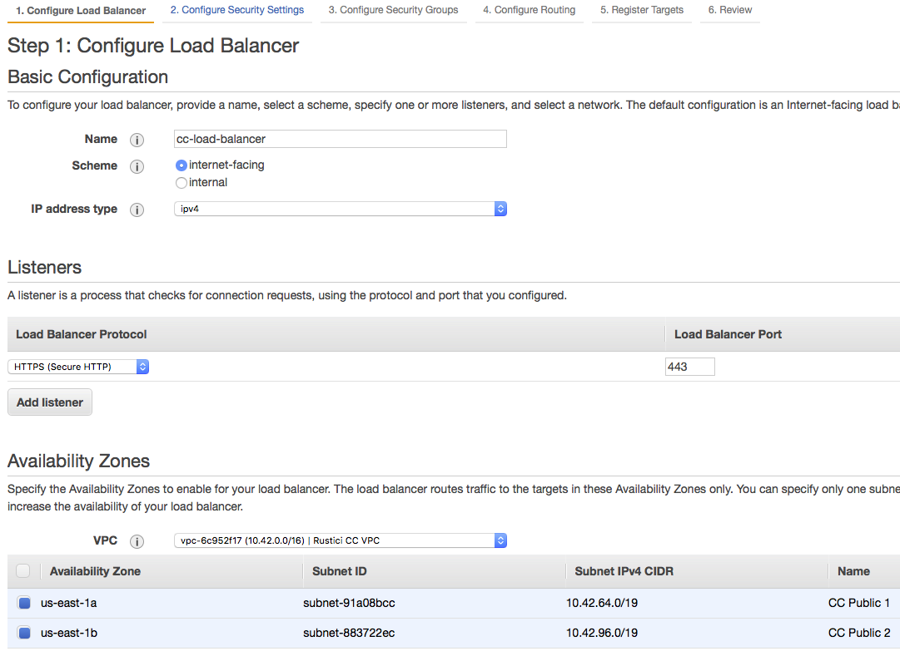
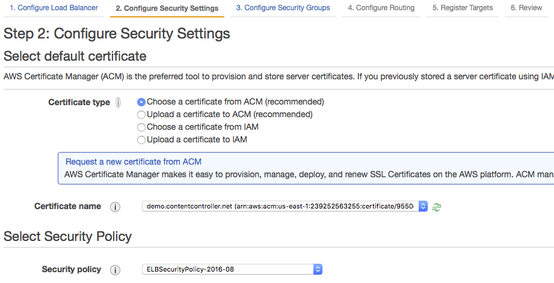
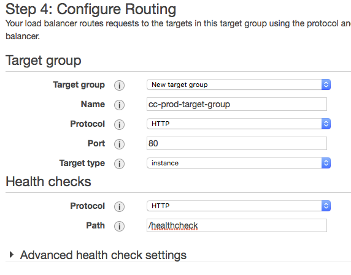

# Load Balancer and Target Group

We'll need to create a load balancer to distribute traffic to your application server(s).  If you use CloudFront and S3, you should use a load balancer - even if you only use 1 application server.  We'll also create a target group, which tells the load balancer which servers to distribute traffic to.

Go to **Services** -> **EC2**.

1. Click **Load Balancers** on the left sidebar, and click **Create Load Balancer**.
2. Click **Create** under **Application Load Balancer**.
3. Name it `cc-load-balancer`,  choose **internet-facing**, and either **ipv4** or **dualstack** (if you want to support IPv6).
4. Change **Load Balancer Protocol** to **HTTPS (Secure HTTP)** and make sure the port is `443`.
5. Select `Rustici CC VPC` for the VPC.
6. Under **Availability Zones**, beside `us-east-1a`, click **Select a subnet...**, then choose the public subnet (`CC Public 1`).  Then choose `CC Public 2` for `us-east-1b`.     
7. Click **Next: Configure Security Settings**.
8. Click **Choose a certificate from ACM** and choose the certificate that you [requested or uploaded earlier](CertificateManager.md).
9. Choose a **Security policy**. See these [AWS SSL Security Policies](https://docs.aws.amazon.com/elasticloadbalancing/latest/classic/elb-security-policy-table.html) docs for more details about which one to pick, or take a look at the [FAQ Security docs](../faq/Security.md).     
10. Click **Next: Configure Security Groups**.
11. Choose **Select an existing security group** and select the `CC Load Balancer` group that you [created earlier](VPC.md).     
12. Click **Next: Configure Routing**.
13. Choose **New Target Group**.
14. Name it `cc-prod-target-group`, use **HTTP** and port `80` with a target type of **instance**.  The health checks should be **HTTP** and the path should be `/healthcheck`.
15. Click **Next: Register Targets** (don't select any instances for now), and then click **Next: Review**.
16. Click **Create**.

**Note:** You may want to enable deletion protection and access logs for your load balancer.  For more information see [Access Logs for Elastic Load Balancers](https://aws.amazon.com/blogs/aws/access-logs-for-elastic-load-balancers/).
