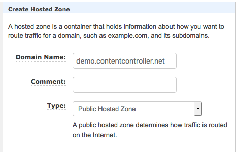

# Route 53

Route 53 will manage the DNS for your Content Controller installation.  You don't _have_ to use it, but it will make your life much easier.  If you're like most organizations, you will probably want to just use a subdomain, and that's perfectly fine.  We will use `demo.contentcontroller.net` for this example.

Go to **Services** -> **Route 53**

## Hosted Zone

1. Click on **Hosted zones** on the left sidebar and click the blue **Create Hosted Zone** button.
2. Enter your domain name here (we'll enter `demo.contentcontroller.net`, since we only want Route 53 to manage the `demo` subdomain), choose **Public Hosted Zone** as the type, and click **Create**.     
3. Now, you should see a list of record sets for your new hosted zone.  Take note of your NS record.  You will need to set these values at your registrar so that DNS can resolve.

## Resources

[What Is Amazon Route 53?](https://docs.aws.amazon.com/Route53/latest/DeveloperGuide/Welcome.html)
