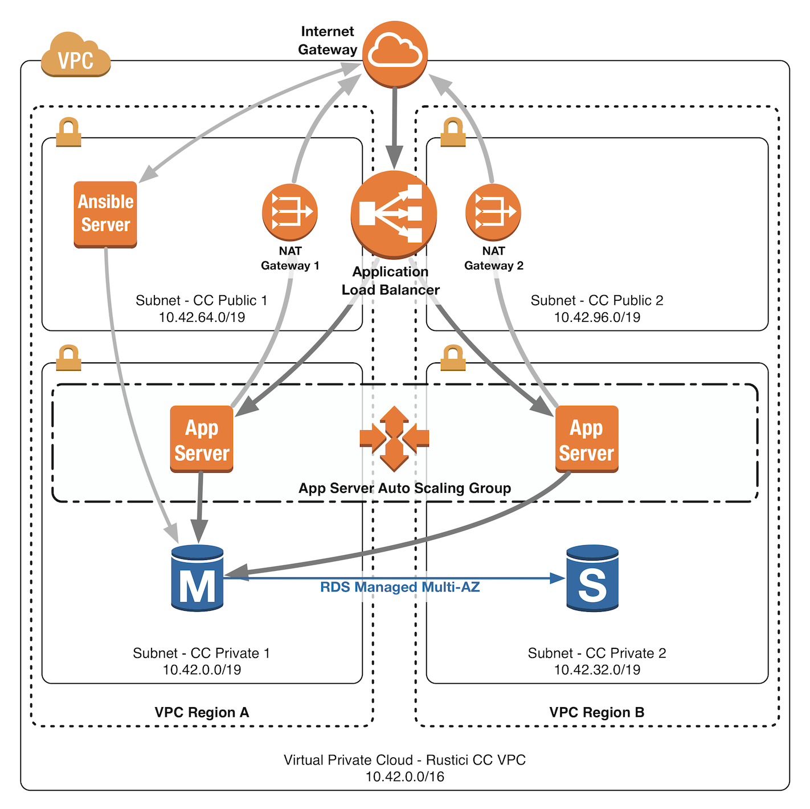
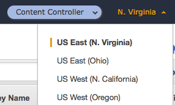
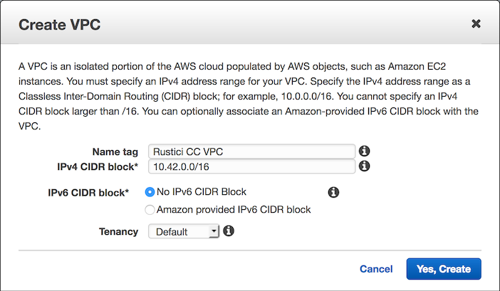
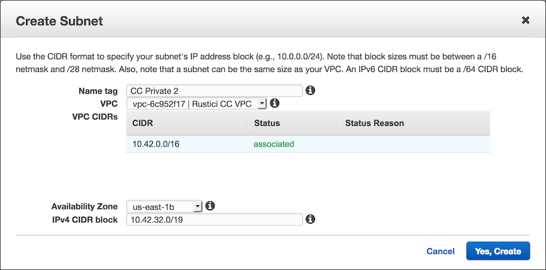
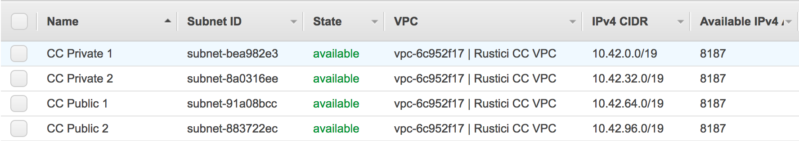
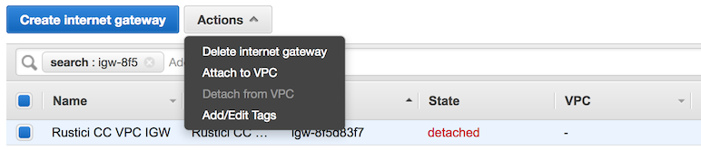
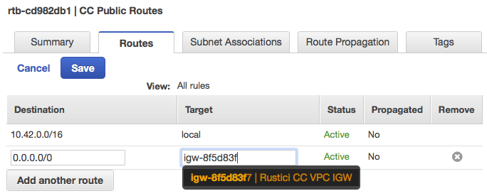
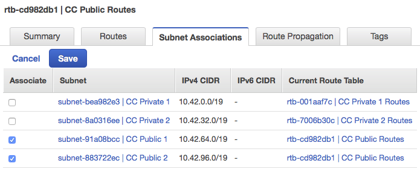
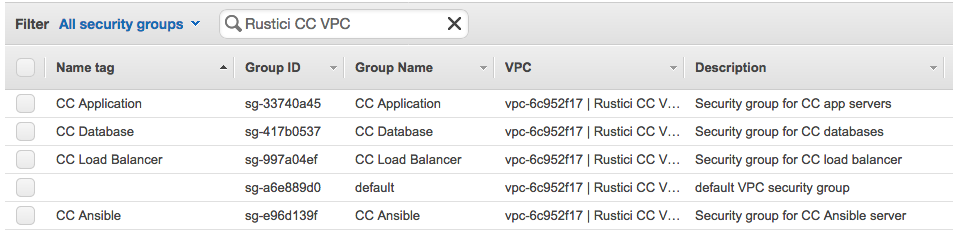
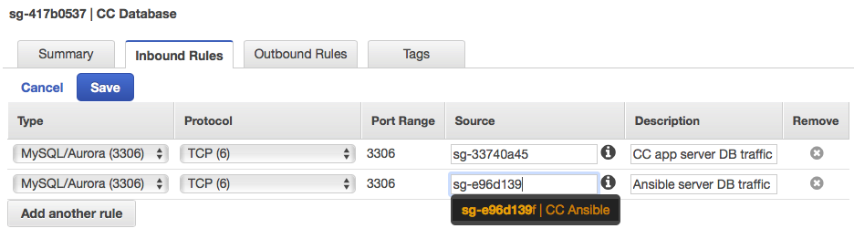

# VPC

A VPC (virtual private cloud) is a logically isolated section of the cloud that allows you to define your own virtual network (similar to having your own router and switches on premise).  We will take advantage of VPC to create our own public and private subnets, which will contain our servers, database, load balancer, etc.

For this example VPC, I picked a Class A IP address pool of `10.42.0.0/16`.  You can pick any Class A or Class B `/16` subnet that you wish.  However, if you plan to setup a VPN into your VPC, make sure the pool doesn't conflict with an IP addresses on your other networks.

Below is a diagram of the network we will define.

Go to **Services** -> **VPC**

1. Choose your preferred region from the top right corner of the screen.   We're going to choose **US East (N. Virginia)**, so all of our availability zone settings will be prefixed with 'us-east-1'. See the [AWS Regions and Availability Zones docs](https://docs.aws.amazon.com/AWSEC2/latest/UserGuide/using-regions-availability-zones.html) for more details.  Keep in mind that pricing varies between regions.    
2. Choose **Your VPCs** on the left sidebar, and then click the blue **Create VPC** button.
3. Enter a name and IPv4 CIDR block and click **Yes, Create**.  If you aren't sure what to enter here, use `Rustici CC VPC` and `10.42.0.0/16`.     
4. Your VPC should now appear in the list of VPCs.  Select it, click **Actions** -> **Enable DNS Hostnames**.  Choose **Yes** and click **Save**.

## Subnets

Next, we'll create subnets for your new VPC.  You may do this however you like, but you'll need at least 2 public subnets in different availability zones and 2 private subnets in different availability zones.  To keep things simple, we're going to create 2 public subnets in zone a and zone b and 2 private subnets in zone a and zone b.

1. Select **Subnets** on the left sidebar, and then click the blue **Create Subnet** button.
2. Select the VPC that you created earlier (such as `Rustici CC VPC`), fill out the rest of the details, and click **Yes, Create**.  If you aren't sure what to enter here, create 4 subnets with the following values:

| Name tag      | Availability zone | IPv4 CIDR block |
| ------------- | ----------------- | --------------- |
| CC Private 1  | us-east-1a        | 10.42.0.0/19    |
| CC Private 2  | us-east-1b        | 10.42.32.0/19   |
| CC Public 1   | us-east-1a        | 10.42.64.0/19   |
| CC Public 2   | us-east-1b        | 10.42.96.0/19   |

The important thing here is that you pick 2 availability zones, and you create 1 public and 1 private subnet in each of the 2 zones. We used `/19` subnets, so you will have room for up to 4 more `/19` subnets in your `/16` in the future.

You should now see a list containing the 4 subnets you just created.

## Internet Gateways

Now, we need to create an Internet Gateway for your VPC.

1. Select **Internet Gateways** on the left sidebar, and then click the blue **Create internet gateway** button.
2. Name the gateway and click **Create**.  If you aren't sure what to enter here, use `Rustici CC VPC IGW`.
3. You will be taken back to the list of gateways.  Check the box beside the gateway that you just created, and click **Actions** -> **Attach to VPC**.  Select the VPC that you created earlier (`Rustici CC VPC` or the name you chose), and then click **Attach**.

## NAT Gateways

Since our private subnet instances will not have public IP addresses, their traffic will have to pass through a NAT gateway in order to access the internet.  The NAT gateways will go in the public subnets, and outbound traffic from the private subnets will be routed to those NAT instances.

1. Select **NAT Gateways** on the left sidebar, and then click the blue **Create NAT Gateway** button.
2. Choose your first public subnet (`CC Public 1`).
3. Click **Create New EIP** (This is the public IP address that outbound traffic will masquerade as).
4. Click **Create a NAT Gateway**.
5. Click **Close** (We'll edit the route tables later).
6. Rename the NAT gateway you just created to `CC Private 1 NAT`.
7. Repeat these steps again to create a second NAT gateway, but this time choose your second public subnet (`CC Public 2`) and name it `CC Private 2 NAT`.

## Route Tables

Currently, all of our subnets have the same route table.  This won't work, because we need the private subnet traffic to flow through a NAT gateway, since those instances won't have a public IP address.  To fix this, we'll create 2 new route tables (1 for each private subnet).

### Public Route Table

The public route table will keep all local VPC traffic inside the VPC, and it will direct all outgoing traffic to the internet gateway.  When your VPC was created, it also created a default route table.  We'll start out by editing that one.

1. Select **Route Tables** on the left sidebar.  Find the route table associated with your VPC (It will say `Rustici CC VPC` or the name you chose under the VPC column) and change its name to `CC Public Routes` .
2. Select the route table.  At the bottom of the screen, a panel will appear with some tabs.  The **Routes** tab should be selected.  Click the **Edit** button.
3. Click **Add Another Route**.
4. In the boxes that appear, set `0.0.0.0/0` for the destination and choose `Rustici CC VPC IGW` for the target, and click **Save**.     
5. Click on the **Subnet Association** tab and click **Edit**.
6. Check the boxes beside both both public subnets and click **Save**.   

### Private Route Table

The private route table will keep all local VPC traffic inside the VPC, and it will direct all outgoing traffic to the NAT instance located in the public subnet.  We'll create 2 route tables so that each private subnet directs traffic to the NAT instance in the public subnet in the corresponding availability zone.

1. Select **Route Tables** on the left sidebar and click **Create Route Table**.
2. Enter `CC Private 1 Routes` for the name tag, choose `Rustici CC VPC` for the VPC, and click **Yes, Create**.
3. The new route table should be selected,  if it isn't, then go ahead and select it.  Select the **Routes** tab and click **Edit**.
4. Click **Add Another Route**.
5. In the boxes that appear, set `0.0.0.0/0` for the destination and choose the `CC Private 1 NAT` for the target, and click **Save**.  Note: AWS does not show the Name for NAT gateways, so you'll need to open the **NAT Gateways** tab on the side and take note of the IDs.
6. Click on the **Subnet Association** tab and click **Edit**.
7. Check the box beside only the `CC Private 1` subnet, and click **Save**.
8. Repeat steps 1-7, but this time use `CC Private 2` and `CC Private 2 NAT` instead.

## Security Groups

We'll create some security groups to make sure only traffic we want is allowed to flow.  The goal here is to keep the potential attack surface as small as possible, so the only traffic that will be allowed from the outside world is HTTPS to the load balancers and SSH to the Ansible control box.

### Create security groups

1. Select **Security Groups** on the left sidebar.
2. For each of these rows click **Create Security Group**, enter the values, and click **Yes, Create**.

| Name tag         | Group name       | Description                          | VPC            |
| ---------------- | ---------------- | ------------------------------------ | -------------- |
| CC Database      | CC Database      | Security group for CC databases      | Rustici CC VPC |
| CC Application   | CC Application   | Security group for CC app servers    | Rustici CC VPC |
| CC Ansible       | CC Ansible       | Security group for CC Ansible server | Rustici CC VPC |
| CC Load Balancer | CC Load Balancer | Security group for CC load balancer  | Rustici CC VPC |

You should now have 5 security groups (1 default and the 4 we just created) for the `Rustici CC VPC`

#### CC Database

Add rules to allow incoming DB traffic from `CC Application` and `CC Ansible`.

1. Select the `CC Database` security group from the list.
2. Click the **Inbound Rules** tab and click **Edit**.
3. Choose **MySQL/Aurora (3306)** for the type, choose `CC Application` for the source, and enter `CC app server DB traffic` for the description.
4. Click **Add another rule**
5. Choose **MySQL/Aurora (3306)** for the type, choose `CC Ansible` for the source, and enter `Ansible server DB traffic` for the description.
6. Click **Save**

#### CC Application

Add rules to allow incoming HTTP traffic from `CC Load Balancer` and all incoming traffic from `CC Ansible`.  Add a rule to allow outgoing DB traffic to `CC Database`.

1. Select the `CC Application` security group from the list.
2. Click the **Inbound Rules** tab and click **Edit**.
3. Choose **HTTP (80)** for the type, choose `CC Load Balancer` for the source, and enter `Load balancer HTTP traffic` for the description.
4. Click **Add another rule**.
5. Choose **ALL Traffic** for the type, choose `CC Ansible` for the source, and enter `Ansible traffic` for the description.
6. Click **Save**.
7. Click the **Outbound Rules** tab, and click **Edit**.
8. Click **Add another rule**.
9. Choose **MySQL/Aurora (3306)** for the type, choose `CC Database` for the destination, and enter `CC app to DB traffic` for the description.
10. Click **Save**.

#### CC Load Balancer

Add rules to allow all incoming traffic ([per AWS docs](https://docs.aws.amazon.com/elasticloadbalancing/latest/classic/elb-security-groups.html)).  Add a rule to allow outgoing HTTP traffic to `CC Application`.

1. Select the `CC Load Balancer` security group from the list.
2. Click the **Inbound Rules** tab and click **Edit**.
3. Choose **ALL Traffic** for the type and enter `0.0.0.0/0` for the source.
4. Click **Save**.
5. Click the **Outbound Rules** tab, and click **Edit**.
6. **Remove** all existing rules, and then click **Add another rule**.
7. Choose **HTTP (80)** for the type, choose `CC Application` for the destination, and enter `Load balancer to CC app traffic` for the description.
8. Click **Save**.

#### CC Ansible

Add a rule to allow incoming SSH traffic.  Add rules to allow outdoing DB traffic to `CC Database` and all outgoing traffic to `CC Application`.

1. Select the `CC Load Balancer` security group from the list.
2. Click the **Inbound Rules** tab and click **Edit**.
3. Choose **SSH (22)** for the type, enter `0.0.0.0/0` for the source, and enter `SSH` for the description. _If possible, restrict this to only the IP address for your machine or the IP address range for your company's network._
4. Click **Save**.
5. Click the **Outbound Rules** tab, and click **Edit**.
6. Click **Add another rule**.
7. Choose **ALL Traffic** for the type, choose `CC Application` for the destination, and enter `Ansible to CC app traffic` for the description.
8. Click **Add another rule**.
9. Choose **MySQL/Aurora (3306)** for the type, choose `CC Database` for the destination, and enter `Ansible to CC DB traffic` for the description.
10. Click **Save**.

## Resources

[What Is Amazon VPC?](https://docs.aws.amazon.com/AmazonVPC/latest/UserGuide/VPC_Introduction.html)

[AWS Fault Tolerance & High Availability](https://media.amazonwebservices.com/architecturecenter/AWS_ac_ra_ftha_04.pdf)

[AWS VPCs and Subnets](https://docs.aws.amazon.com/AmazonVPC/latest/UserGuide/VPC_Subnets.html)
